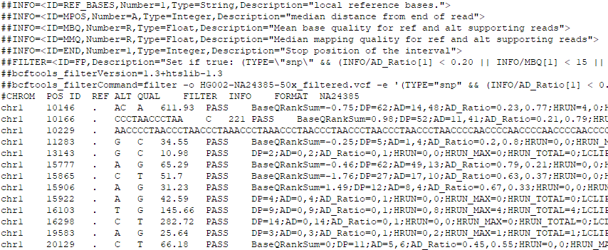
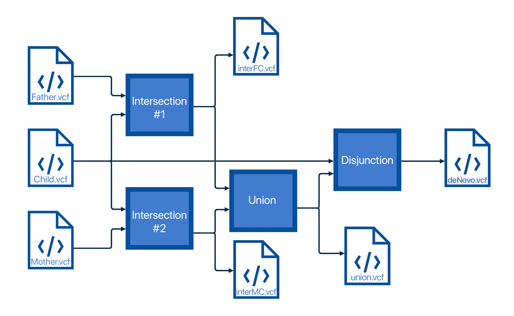
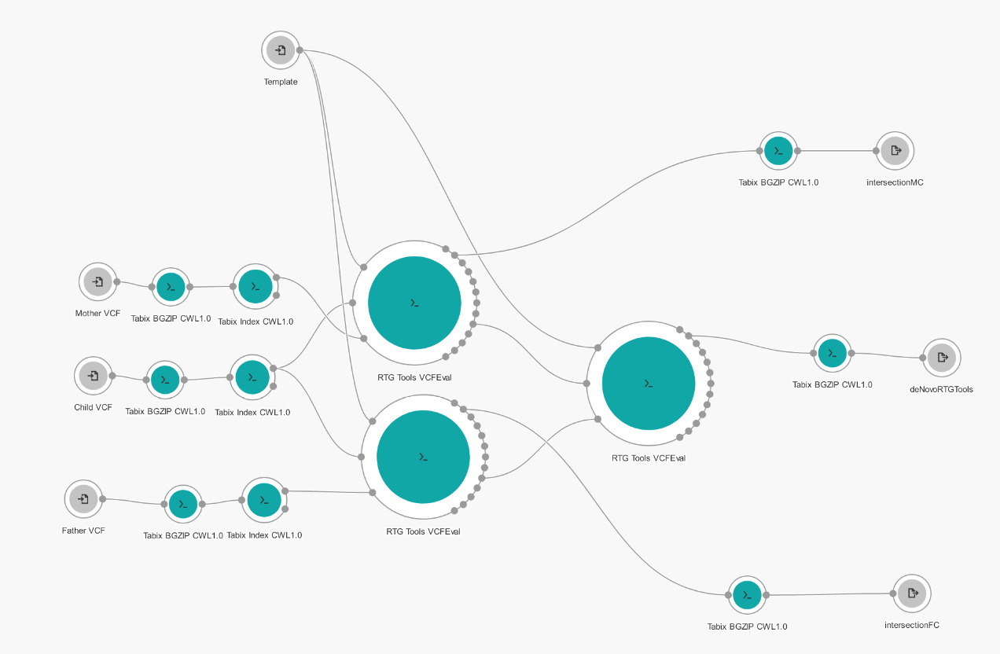

# De novo variants in the reconstructed GIAB genome

## Summary
&nbsp;&nbsp;&nbsp;&nbsp;The goal of this project is to find de novo variants in genome of a child (son), given three (mother, father and son) GIAB sample files in FASTQ format. First, it was necessary to reconstruct the GIAB samples from FASTQ to VCF files which represent variations from reference genome. In second part we needed to write Python script to analyse three VCF files and to find all de novo variants in son. Thirdly, we used the RTG Tools VCFEval, tool that performs sophisticated comparison of VCF files, to find more accurate number of de novo variants in child. Finally, we compared results we got from our script to ones we got using tool made by Seven Bridges. We also used SBG VCF Benchmark for better visual representation of compared results.

---
### De novo
&nbsp;&nbsp;&nbsp;&nbsp;A genetic alteration that is present for the first time in one family member as a result of a variant (or mutation) on one of chromosomes of one of the parents is called de novo variant. It is also called new mutation or new variant.

---
### VCF files
&nbsp;&nbsp;&nbsp;&nbsp;The Variant Call Format (VCF) specifies the format of a text file used in bioinformatics for storing gene sequence variations. It contains the VCF header and the columns of a VCF. The header begins the file and provides metadata describing the body of the file. The body of VCF follows the header, and is tab separated into 8 mandatory columns and an unlimited number of optional columns that may be used to record other information about the sample(s).

*VCF file example*  

---
### Environment
&nbsp;&nbsp;&nbsp;&nbsp;This project was executed on two platforms. Every tool execution was done on Seven Bridges platform while all Python scripts were done locally on Ubuntu 20.04 OS in Jupyter Notebook. 

## I Reconstruction of GIAB samples
&nbsp;&nbsp;&nbsp;&nbsp;GRAF Germline Variant Detection Workflow tool was used to reconstuct whole genome from initial FASTQ files given the reference genome GRCh38. Output of the previously mentioned tool is BAM file, which represents whole genome that is reconstructed and alligned, and VCF file, which represents all variations each sample had relative to reference genome GRCh38. In the continuation of the project, we will use three VCF files we recieved from this tool.

## II Creating tool for finding de novo child variants 
&nbsp;&nbsp;&nbsp;&nbsp;The code is organized into three parts. The first part will make a cross-section of one parent and a child, which represents all the mutations that a child could have gotten from that parent. Then, the union of these intersections was performed in order to get all the variations child could have gotten from the parents by inheritance. In the end, the disjunction of the child and the obtained union was made, which will give all the variations that the child has without being the result of inheritance. 

*Code structure*  

---
### Somatic chromosomes
&nbsp;&nbsp;&nbsp;&nbsp; Talk about inheritance and all combinations

### X and Y chromosomes
&nbsp;&nbsp;&nbsp;&nbsp; Talk about inheritance and all combinations and all problems and errors with XY chromosomes

## III Finding de novo variants using RTG Tools VCFEval 
&nbsp;&nbsp;&nbsp;&nbsp;We used RTG Tools VCFEval to find more accurate number of de novo variants in child genome. This was done by creating Workflow application on Seven Bridges platform. The application first used Tabix BGZIP and Index tools to convert VCF files to the required format required by VCFEval tool. The first comparison was done on mother-son and father-son pair (parents as baseline, child as calls) and false-positive output was taken. False-positive VCF contains called variants that were not in the baseline VCF, which in this case means childs variants that were not in parents. Two false-positive VCF files were forwarded to second comparison where tru-positive output was taken. True positive VCF represents variants that exist in both input VCF files, in other words, a variation of the child that is not found in either parent or de novo. 

*RTG Tools VCFEval application structure*  

---

&nbsp;&nbsp;&nbsp;&nbsp;As it can be seen from picture above, we stored true-positive VCF files after first comparison. True-positive VCF is equivalent of intersection done in this project. This was done so we can at the end not only compare end results (number of de novo variants) but so we can compare how each component (intersection and union/disjunction) performs against professional sophisticated comparison done by RTG Tools VCFEval.

## IV Results
&nbsp;&nbsp;&nbsp;&nbsp;Results obtained in this project can be seen in a table below. Column 'Partial' represents results we got when we used intersection created by RTG Tools VCFEval while union and disjunction were executed by scripts from this project. In other words, how much accurate VCFEval tool is on separate components of our project.

&nbsp; | This project | Partial | RTG Tools VCFEval
------------- | ------------- | ------------ | -------------
Number of de novo variants detected | **184,689** | 131,570 | **85,381**
Percentage [%] | **3.765** | 2.682 | **1.740** 

&nbsp;&nbsp;&nbsp;&nbsp;As it can be seen from table above, number of de novo variants this project achieved is much greater than it should be. This is happening because there are some situations our script does not detect resulting in a lot of false positive de novo variations. Some situations that our script will not detect:
  
  * The sequencer divides one longer variation into several smaller ones. Our script will report all of the smaller ones as de novo instead of detecting longer one.
  * If both parents have genotype 1/2 where the child inherited one of both and the sequencer shortened REF and ALT of that variant. The script will detect de novo if ref and alt are different eg. position 3719890, chr1 Father: TTG-> T, TTGTG, Mother: TTG-> T, TTGTGTG. Child inherited the other two D: T-> TTG, TTGTG. It will be detected as de novo even though it isn't.
  * The mutation occurred on one chromosome of the child. The sequencer then, instead of changing only one ALT of the child, he shortens them both and our script reports de novo on both chromosomes insead of on only one. Eg. position 775840, chr1 - both parents: C-> CA 1/1 child: CA-> C, CAA where De Novo only CA-> C and not both 

## Future improvements
&nbsp;&nbsp;&nbsp;&nbsp;
