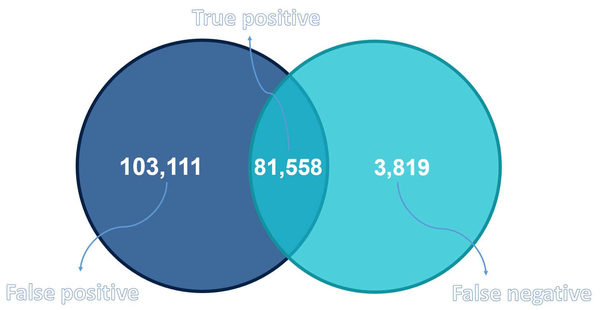

# De novo variants in the reconstructed GIAB genome

## Summary
&nbsp;&nbsp;&nbsp;&nbsp;The goal of this project is to find de novo variants in the genome of a child (son), given three (mother, father and son) [GIAB sample](https://github.com/PacificBiosciences/DevNet/wiki/Genome-in-a-Bottle-Ashkenazim-Trio) files in [FASTQ](https://en.wikipedia.org/wiki/FASTQ_format) format. First, it was necessary to reconstruct the GIAB samples from FASTQ to [BAM](https://support.illumina.com/help/BS_App_RNASeq_Alignment_OLH_1000000006112/Content/Source/Informatics/BAM-Format.htm) and get VCF files which represent variants from reference genome. Secondly, we needed to write a Python script to analyse the three VCF files and to find all de novo variants in the son. Thirdly, we used [RTG Tools VCFEval](https://github.com/RealTimeGenomics/rtg-tools), a tool that performs sophisticated comparison of VCF files, to find the number of de novo variants in the child more accurately. Finally, we compared the results we got from our script to the ones we got using the tool made by Seven Bridges. We also used [SBG VCF Benchmark](https://docs.sevenbridges.com/docs/vcf-benchmarking-app) for better visual representation of compared results.

---
### De novo
&nbsp;&nbsp;&nbsp;&nbsp;A genetic alteration that is present for the first time in one family member as a result of a variant (or mutation) on one of chromosomes of one of the parents is called de novo variant. It is also called new mutation or new variant.

---
### VCF files
&nbsp;&nbsp;&nbsp;&nbsp;The Variant Call Format ([VCF](https://en.wikipedia.org/wiki/Variant_Call_Format)) specifies the format of a text file used in bioinformatics for storing gene sequence variations. It contains the VCF header and the columns of a VCF. The header begins the file and provides metadata describing the body of the file. The body of VCF follows the header, and is tab separated into 8 mandatory columns and an unlimited number of optional columns that may be used to record other information about the sample(s).

*VCF file example*  

---
### Environment
&nbsp;&nbsp;&nbsp;&nbsp;This project was executed on two platforms. Every tool execution was done on [Seven Bridges platform](cgc.sbgenomics.com/) while all Python scripts were done locally on [Ubuntu 20.04 OS](https://releases.ubuntu.com/20.04/) in [Jupyter Notebook](https://jupyter.org/). 

## I Reconstruction of GIAB samples
&nbsp;&nbsp;&nbsp;&nbsp;[GRAF Germline Variant Detection Workflow tool](https://docs.sevenbridges.com/docs/graph-germline-variant-detection-workflow-tutorial) was used to reconstuct whole genome from initial FASTQ files given the reference genome [GRCh38](https://www.ncbi.nlm.nih.gov/assembly/GCF_000001405.26/). Output of the previously mentioned tool is a BAM file, which represents the whole genome that is reconstructed and aligned, and a VCF file, which represents all variations each sample had relative to reference genome GRCh38. In the continuation of the project, we will use the three VCF files we recieved from this tool.

## II Creating tool for finding de novo child variants 
&nbsp;&nbsp;&nbsp;&nbsp;The code is organized into three parts. The first part will make an intersection of one parent and a child, which results in all the mutations that a child could have gotten from that parent. Then, an union of these intersections was performed in order to get all the variations child could have gotten from the parents by inheritance. In the end, the disjunction of the child and the obtained union was made, which will give all the variations that the child has that weren't inherited. 

*Code structure*  

---
### Somatic chromosomes
&nbsp;&nbsp;&nbsp;&nbsp; Since a child inherits 1 chromosome from the mother and 1 chromosome from the father in each pair of somatic chromosomes, depending on variants the parents have on their chromosomes, there's a lot of combinations of variants the child could inherit from the parents (eg. if a mother has 0/1 [genotype](https://www.genome.gov/genetics-glossary/genotype), the child has 1/1, and they have the same variant sequence, the child could have gotten 1 chromosome with that variant from the mother, and the other one is either a de novo variant or it's inherited from the father. If it's a different variant sequence in child and the mother, then it's a de novo variant since the child must have inherited either mother's variant or the sequence from the reference genome on 1 chromosome on that position). For the purpose of covering all the possible combinations that can happen on one position in one chromosome, we made tables consisting of 3 columns - genotype in the first file, genotype in the second file, and the action we do in that case. 

### X and Y chromosomes
&nbsp;&nbsp;&nbsp;&nbsp; In the GIAB samples in this project the child was male, meaning he inherited X chromosome from the mother and Y chromosome from the father. It would make sense then, to intersect mother's X and child's X chromosome and search for inherited variants, and then father's Y and child's Y. But, variants on the Y chromosome appear in the mother VCF file variant. This is because X and Y chromosomes have many similar sequences, and GRAF tool then aligns some reads incorrectly to the X when they belong on the Y chromosomes, and vice versa. For the same reason, all three VCF files have some variants on their X and Y chromosomes with 1/2 genotype, which should (except for the mother) be impossible, since they have only 1 of each sex chromosome. That is why we use a different logic for these chromosomes, that (as far as our testing showed) gave the best results when compared to the [RTG Tools VCFEval](https://github.com/RealTimeGenomics/rtg-tools).

## III Finding de novo variants using RTG Tools VCFEval 
&nbsp;&nbsp;&nbsp;&nbsp;We used [RTG Tools VCFEval](https://github.com/RealTimeGenomics/rtg-tools) to find the number of de novo variants in the child genome more accurately. This was done by creating a [Workflow](https://docs.sevenbridges.com/docs/create-a-workflow) application on [Seven Bridges platform](cgc.sbgenomics.com/). The application first used [Tabix BGZIP](https://manpages.debian.org/stretch/tabix/bgzip.1) and [Index](http://www.htslib.org/doc/tabix.html) tools to convert VCF files to the format required by [VCFEval](https://github.com/RealTimeGenomics/rtg-tools) tool. The first comparison was done on the mother and the son, and second on the father and the son (parents as baseline, child as calls) and false-positive output was taken from both comparisons. False-positive VCF contains called variants that were not in the baseline VCF, which in this case means child's variants that were not in the parent. Two false-positive VCF files were forwarded to the third comparison where true-positive output was taken. True positive VCF represents variants that exist in both input VCF files, in other words, a variation of the child that is not found in either parent or de novo. 

*RTG Tools VCFEval application structure*  

---

&nbsp;&nbsp;&nbsp;&nbsp;As it can be seen from the picture above, we stored true-positive VCF files after the first and second comparison. True-positive VCF is equivalent of the intersection done in this project. This was done so that we can not only compare end results (the number of de novo variants), but also so that we can compare how each component (intersection and union/disjunction) performs against professional sophisticated comparison done by [RTG Tools VCFEval](https://github.com/RealTimeGenomics/rtg-tools).

## IV Results and future improvements
&nbsp;&nbsp;&nbsp;&nbsp;Results obtained in this project can be seen in the table below. The column 'Partial' represents the results we got when we used intersection created by [RTG Tools VCFEval](https://github.com/RealTimeGenomics/rtg-tools), while union and disjunction were executed by scripts from this project. In other words, how accurate [VCFEval tool](https://github.com/RealTimeGenomics/rtg-tools) is on separate components of our project.

&nbsp; | This project | Partial | RTG Tools VCFEval
------------- | ------------- | ------------ | -------------
Number of de novo variants detected | **184,689** | 131,570 | **85,381**
Percentage [%] | **3.765** | 2.682 | **1.740** 

&nbsp;&nbsp;&nbsp;&nbsp;As it can be seen from the table above, the number of de novo variants this project found is much greater than it should be. This is happening because there are some situations our script does not detect, resulting in a lot of false positive de novo variants. Some situations that our script will not detect and can be implemented in the future:
  
  * The [GRAF](https://docs.sevenbridges.com/docs/graph-germline-variant-detection-workflow-tutorial) tool divides one longer variation into several smaller ones. Our script will report all of the smaller ones as de novo variants instead of detecting longer one, if the same variants do not exist in either parents.
  * If both parents have genotype 1/2 where the child inherited one of both and the sequencer shortened REF and ALT of that variant. The script will detect de novo variant if ref and alt are different, eg. position 3719890, chr1 | Father: TTG-> T, TTGTG | Mother: TTG-> T, TTGTGTG | Child inherited the other two D: T-> TTG, TTGTG. It will be detected as de novo variant even though it isn't.
  * The mutation occurred on one chromosome of the child. The [GRAF](https://docs.sevenbridges.com/docs/graph-germline-variant-detection-workflow-tutorial) tool then, instead of changing only one ALT of the child, shortens them both and our script reports de novo variant on both chromosomes instead of on only one. Eg. position 775840, chr1 | both parents: C-> CA 1/1 | Child: CA-> C, CAA where de novo is only CA-> C and not both.

---
&nbsp;&nbsp;&nbsp;&nbsp;More detailed comparison of the results was done by [SBG VCF Benchmark tool](https://docs.sevenbridges.com/docs/vcf-benchmarking-app) and [Venn diagram](https://en.wikipedia.org/wiki/Venn_diagram) showing number of true positives, false positives and false negatives between our project and [RTG Tools VCFEval](https://github.com/RealTimeGenomics/rtg-tools)  results can be seen below.

*Venn diagram comparing results*  

